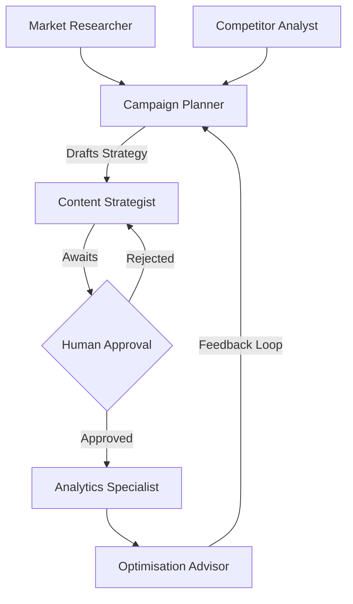

# AI Marketing Strategy Manager

A multi-agent marketing strategy platform powered by CrewAI, FastAPI, and React.

## Overview
This platform automates the marketing strategy lifecycle using a team of specialized AI agents:
1. **Market Researcher**: Scours the web for industry trends.
2. **Competitor Analyst**: Analyzes top competitors.
3. **Campaign Planner**: Synthesizes data into a concrete marketing plan.
4. **Content Strategist**: Generates a detailed content calendar (after human approval).
5. **Analytics Specialist**: Reviews simulated performance metrics.
6. **Optimisation Advisor**: Suggests strategic pivots.

## Tech Stack
- **Backend**: Python, FastAPI, CrewAI, LangChain, Groq API (Llama 3).
- **Frontend**: React (Vite), Vanilla CSS with Glassmorphism UI.
- **Tools**: DuckDuckGo Search API, Mock Analytics API.

## Setup Instructions

### Backend
1. Navigate to the `backend` directory.
2. Create a `.env` file and add your Groq API key: `GROQ_API_KEY=your_key`
3. Activate the virtual environment and install dependencies:
   ```bash
   python -m venv venv
   source venv/bin/activate  # Or .\venv\Scripts\Activate.ps1 on Windows
   pip install fastapi uvicorn crewai python-dotenv duckduckgo-search langchain-groq pydantic
   ```
4. Run the server:
   ```bash
   uvicorn main:app --reload
   ```

### Frontend
1. Navigate to the `frontend` directory.
2. Install dependencies:
   ```bash
   npm install
   ```
3. Run the development server:
   ```bash
   npm run dev
   ```

## Architecture Diagram

