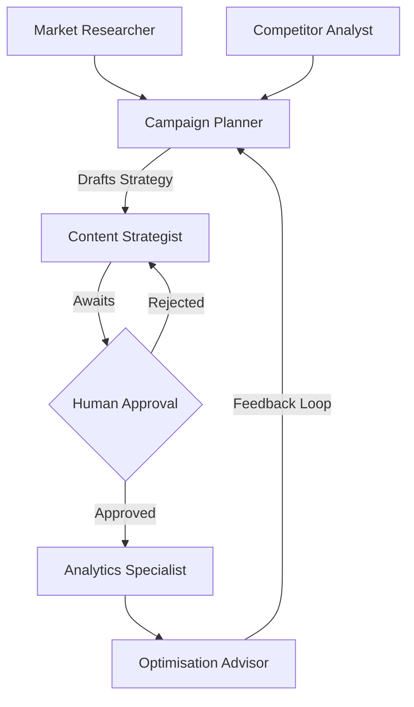

# AI Marketing Strategy Manager
## Automating End-to-End Marketing Campaigns with Multi-Agent Systems

---

## Slide 1: The Problem
- Marketing moves too fast for manual research and execution.
- Teams struggle to analyze competitors, trends, and analytics in real-time.
- **Result**: Missed opportunities, disjointed campaigns, and slow time-to-market.

---

## Slide 2: The Solution
- **AI Marketing Strategy Manager**: A multi-agent platform orchestrating the entire marketing lifecycle.
- Leverages **CrewAI** to assign specific roles to LLM-powered agents.
- Automates research, strategy, content generation, and optimization.

---

## Slide 3: Meet the Agents
1. **Market Researcher**: Identifies emerging trends.
2. **Competitor Analyst**: Spies on the competition.
3. **Campaign Planner**: Drafts the master strategy.
4. **Content Strategist**: Creates actionable content calendars.
5. **Analytics Specialist**: Reads campaign performance.
6. **Optimisation Advisor**: Pivots strategy based on data.

---

## Slide 4: System Architecture

- **Frontend**: React (Vite) with a premium Glassmorphism UI.
- **Backend**: FastAPI serving CrewAI agents.
- **LLM**: Groq (Llama 3) for blazing fast reasoning.

---

## Slide 5: Human-in-the-Loop
- AI is powerful, but human intuition is irreplaceable.
- **Checkpoint**: The system pauses after the Campaign Plan is generated.
- Marketing Managers review, edit, and approve the plan before the Content Strategist generates the final deliverables.

---

## Slide 6: Tool Integration
- **DuckDuckGo Search API**: Real-time web search for trends.
- **Mock Analytics API**: Simulates CTR, Conversion Rate, and ROI.
- **Markdown File I/O**: Saves generated strategies to disk for portability.

---

## Slide 7: Next Steps & Advanced Features
- **RAG Integration**: Feed past campaign data into a ChromaDB vector store.
- **Social Media API**: Direct posting to X (Twitter) and LinkedIn.
- **Long-Term Memory**: Allow agents to remember competitor moves across sessions.
